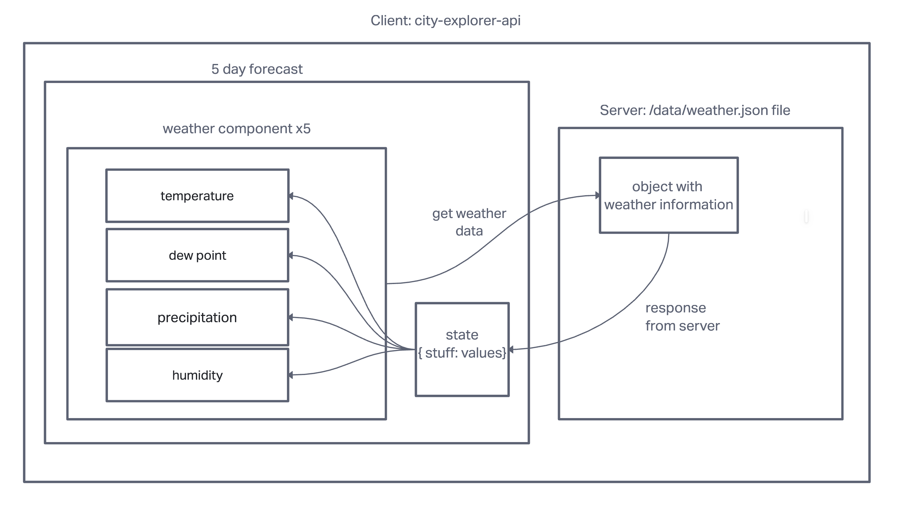

# city-explorer-api

## Author: Erin Ranta

## Overview

THis is a project where we use the beck-end server to gather data and present it back to the front-end.

## Getting Started

1. Clone Repo
2. NPM Install
3. NPM Start
4. Server

## Architechture

Node, Express, Dotenv, Cors

## Change Log

19JUL2022

Collaborator: Austin Limanek

Name of feature: ________________________Weather________

Estimate of time needed to complete: 2.5 hours

Start time: 5PM

Finish time: ?

Actual time needed to complete: _Many hours split up. spent a long time with npm start (is not working)

Name of feature: Movies

Estimate of time needed to complete: n/a_____

Start time: _____

Finish time: _____

Actual time needed to complete: Will add when completed

